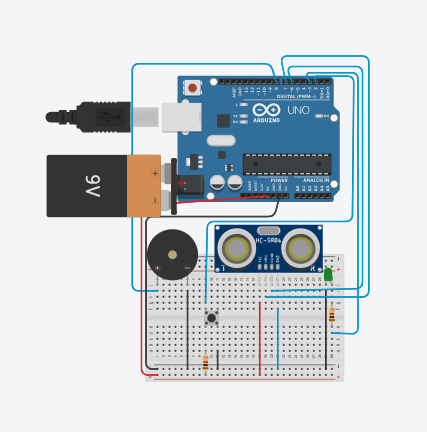

# Módulo de Detecção de Objetos

Este é um projeto de sistema embarcado para detecção de objetos, ideal para aplicações como bengalas inteligentes ou sistemas de alerta de proximidade.

## Diagrama do Circuito

## Arquivos

- `circuit.png`: Diagrama do circuito eletrônico utilizado no projeto.
- `code.ino`: Código-fonte Arduino que implementa a lógica de detecção de objetos utilizando sensores.

## Requisitos

- Arduino Uno (ou compatível)
- Sensor Ultrassônico HC-SR04
- Buzzer
- Fios de conexão e protoboard
- (Opcional) LED indicador

## Como usar

1. Conecte os componentes conforme o diagrama em `circuit.png`.
2. Abra o arquivo `code.ino` na IDE do Arduino.
3. Compile e envie para o seu Arduino.
4. O sistema detectará objetos à frente do sensor e acionará o buzzer em resposta.

## Licença

Este projeto está sob a licença MIT.
